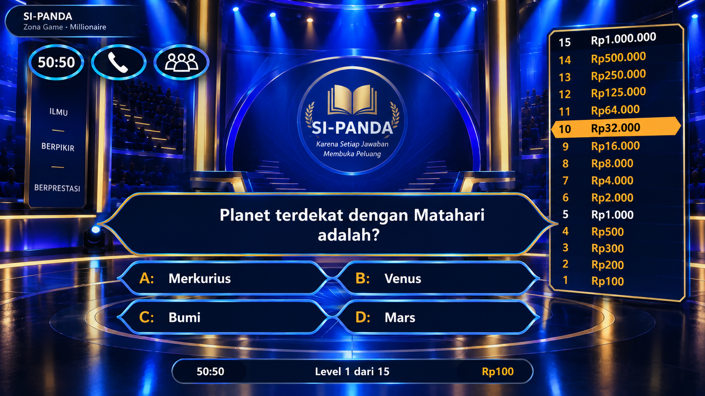

# PHASE 06C --- MILLIONAIRE GAME-SHOW FIDELITY & REVEAL SKIN

## SI-PANDA v3 · Visual Behavior + High-Fidelity Interaction

**Status:** VISUAL/INTERACTION POLISH ONLY\
**Parent:** PHASE 06A --- LOCAL LIVE SERVER GAME REGISTRATION FIX\
**Supersedes visual target of:** PHASE 06B\
**Scope:** `millionaire/millionaire.css` + minimal presentation-only
markup/classes in `millionaire/MillionaireGame.js`\
**Goal:** Make the Millionaire screen feel like a real classic
television quiz show, with special attention to question panel, answer
panels, prize ladder, lifelines, suspense, answer reveal, and win/loss
animation.

------------------------------------------------------------------------

# 0. VISUAL REFERENCE --- SOURCE OF TRUTH

## IMPORTANT

The visual reference images pasted into this document are part of the
design specification.

**OpenCode MUST inspect the actual images pasted below before
implementation.**

Do not implement this phase from text description alone.

### REFERENCE IMAGE --- Overall gameplay screen, Question panel, Answer panels / locked state, Correct answer reveal, Wrong answer reveal, Prize ladder, Lifelines



Purpose: - overall composition; - question position; - answer
position; - prize ladder; - lifelines; - studio/background; - relative
scale and spacing; - exact visual language of question panel; - shape; - border; -
glow; - typography; - spacing; - alignment; - answer panel shape; - selected state; - locked state; -
spacing; - A/B/C/D treatment; - green flash/pulse; - glow intensity; - reveal timing; -
correct-answer treatment; - red flash/pulse; - selected wrong answer treatment; - correct
answer reveal; - transition toward game-over state; - ladder proportions; - current-level highlight; - safe-level
appearance; - reached levels; - typography and spacing; - 50:50; - class/audience; - friend/phone; - used/active
treatment.

> If fewer images are available, use the available images. Do not invent
> missing details and do not claim pixel-perfect matching where no
> reference exists.

------------------------------------------------------------------------

# 1. CORE DESIGN DIRECTIVE

The current implementation is functionally correct but must not look
like a generic web dashboard.

Target visual hierarchy:

``` text
REAL TV QUIZ SHOW
       +
SI-PANDA BRANDING
       +
EDUCATIONAL GAME CONTENT
```

Not:

``` text
WEB DASHBOARD
       +
GAME-SHOW COLORS
```

The studio background, question, answers, prize ladder, lifelines, and
reveal effects must feel like parts of one coherent game-show set.

------------------------------------------------------------------------

# 2. ABSOLUTE GAMEPLAY CONTRACT

This phase MUST NOT change gameplay semantics.

Do NOT modify:

-   12-state FSM;
-   legal transitions;
-   question selection;
-   answer indices;
-   prize ladder data;
-   safe levels;
-   score;
-   virtual Rupiah;
-   timer duration/logic;
-   lifeline logic;
-   walk-away;
-   result payload;
-   `finishGame()`;
-   `canSaveGameResult()`;
-   dispatcher;
-   production/fallback question source;
-   `MillionaireData.js`;
-   `MillionaireQuestions.js`;
-   `code.gs`;
-   `code_v2.gs`;
-   GameResults;
-   spreadsheet;
-   admin;
-   17 existing games.

CSS/classes/data-state may change only to improve presentation.

------------------------------------------------------------------------

# 3. GAME-SHOW VISUAL STATES

The presentation must make these phases visually distinct:

``` text
INTRO
  ↓
READY
  ↓
QUESTION
  ↓
SELECTING
  ↓
LOCKED
  ↓
REVEAL / SUSPENSE
  ↓
CORRECT or WRONG
  ↓
next QUESTION / GAME OVER / VICTORY
```

Do not add a new gameplay state to the FSM.

Use existing `data-state` plus presentation classes/attributes if
necessary.

------------------------------------------------------------------------

# 4. QUESTION PANEL

## Target

The question panel is the main visual focal point.

It should resemble a premium television quiz-show question plate:

-   dark navy/black;
-   electric-blue outer border;
-   subtle gold accent;
-   pointed/hexagonal ends;
-   layered depth;
-   strong but controlled glow;
-   centered white question text;
-   compact kicker such as `SOAL LEVEL 1`;
-   no white dashboard-card appearance.

### Shape

Prefer a pointed capsule/hexagonal construction similar to the supplied
reference.

Use CSS pseudo-elements or `clip-path` if needed.

The panel should visually connect to the answer panels below it.

### Text

Question: - white; - bold; - centered; - highly readable; -
responsive; - no clipping.

Do not let question metadata overpower the actual question.

------------------------------------------------------------------------

# 5. ANSWER PANELS

Four answers must look like integrated TV quiz-show answer plates.

Desktop:

``` text
┌─────────────── A ───────────────┐    ┌─────────────── B ───────────────┐
│            Merkurius            │    │              Venus               │
└─────────────────────────────────┘    └─────────────────────────────────┘

┌─────────────── C ───────────────┐    ┌─────────────── D ───────────────┐
│              Bumi               │    │               Mars               │
└─────────────────────────────────┘    └─────────────────────────────────┘
```

The exact proportions must follow the reference image.

### Base

-   dark navy;
-   blue glowing outline;
-   pointed ends;
-   white answer text;
-   gold A/B/C/D label;
-   subtle depth.

Do NOT use large white rectangular cards.

------------------------------------------------------------------------

# 6. ANSWER INTERACTION --- CRITICAL

This is a mandatory part of the skin.

## 6.1 Selecting an answer

When the player taps an answer:

-   selected answer becomes visually emphasized;
-   gold accent increases;
-   blue/gold glow becomes stronger;
-   other options remain visible;
-   no immediate green/red result.

The player must still be able to see that the answer is selected but not
yet revealed.

------------------------------------------------------------------------

# 7. LOCKED / SUSPENSE

After `Kunci Jawaban`:

``` text
SELECTING
   ↓
LOCKED
   ↓
SUSPENSE / REVEAL
```

The selected answer must remain prominent.

The interface should create suspense through:

-   subtle pulse;
-   glow;
-   controlled brightness;
-   optional short scale movement;
-   question/answer visual tension.

Do NOT create a new FSM state.

Use CSS animation driven by existing `data-state`.

Animation must be short and controlled.

------------------------------------------------------------------------

# 8. CORRECT ANSWER REVEAL --- MANDATORY

When the selected answer is correct, the selected answer panel must
**flash/pulse green**.

Required visual sequence:

``` text
LOCKED
   ↓
SUSPENSE
   ↓
GREEN FLASH
   ↓
CORRECT
   ↓
next level
```

### Green reveal requirements

The correct panel should:

-   transition from blue/gold;
-   flash bright green;
-   emit visible green glow;
-   pulse/flash at least twice or otherwise clearly communicate success;
-   settle into a stable correct state;
-   retain readable text.

Suggested visual language:

``` text
normal:
dark navy + blue border

reveal:
green border + bright green glow + brightness pulse

settled:
dark green/navy + green/gold accent
```

Do not make the entire screen green.

The **answer panel** is the main reveal target.

------------------------------------------------------------------------

# 9. WRONG ANSWER REVEAL --- MANDATORY

When the selected answer is wrong:

``` text
LOCKED
   ↓
SUSPENSE
   ↓
RED FLASH
   ↓
WRONG
   ↓
GAME OVER
```

The selected wrong answer must:

-   flash red;
-   pulse red;
-   emit strong but controlled red glow;
-   remain readable;
-   visibly communicate failure.

At the same time, the actual correct answer should be revealed in green
when the result is shown, if the existing render flow exposes the
correct answer at that point.

The red treatment must be clearly distinguishable from the green success
treatment.

------------------------------------------------------------------------

# 10. REVEAL ANIMATION TIMING

Do not use instant color replacement only.

Target approximate sequence:

``` text
0ms       LOCKED
300ms     suspense
600ms     reveal begins
600–1400  green/red pulse
1400ms    settled result
```

Exact timing may be adjusted to match the reference image and existing
gameplay flow.

Important: - CSS animation must not block the existing state
transition; - do not add a new timer or gameplay delay unless already
supported by the engine; - visual animation must gracefully handle fast
state transitions.

If JavaScript is required only to add/remove a presentation class, keep
it strictly presentation-only.

------------------------------------------------------------------------

# 11. PRIZE LADDER

The prize ladder is one of the defining elements of the screen.

It must be:

-   vertical;
-   narrow;
-   dark navy/black;
-   blue border;
-   gold accent;
-   visually integrated with the studio;
-   readable at all levels.

### Current level

Current level must have the strongest highlight.

Use: - gold/amber; - stronger glow; - high contrast; - subtle scale or
brightness; - clear visual separation.

### Safe levels

Levels 5, 10, 15 remain visually special.

Do not change the canonical data.

### Reached levels

Use a restrained secondary treatment.

### Important

Do not turn the ladder into a large white sidebar.

------------------------------------------------------------------------

# 12. LIFELINES

Three controls:

-   50:50
-   Tanya Kelas
-   Tanya Teman

Use the visual language from the reference:

-   oval/circular;
-   dark;
-   blue glow;
-   gold active accent;
-   white/gold icon/text.

Used state: - visibly consumed; - reduced brightness; - no interaction.

Do not change the underlying lifeline behavior.

------------------------------------------------------------------------

# 13. HEADER

The header must visually belong to the studio.

Avoid:

``` text
white rounded web-app navbar
```

Prefer:

-   dark translucent;
-   blue border;
-   subtle gold accent;
-   SI-PANDA identity;
-   level/prize;
-   timer.

The timer remains prominent but should not overpower the question.

------------------------------------------------------------------------

# 14. TIMER VISUAL

Existing timer semantics remain unchanged.

Visual:

``` text
normal → blue/electric
≤5 sec → red urgent
```

Urgent timer may pulse.

Do not modify `M.TIMER_SECONDS`.

------------------------------------------------------------------------

# 15. STUDIO BACKGROUND

Use existing Phase 05/06 WebP backgrounds.

Desktop: - B1/B3 as already mapped.

Mobile: - B2/B4 as already mapped.

Do not replace existing backgrounds unless the reference proves a
current asset is unusable.

The UI should occupy the foreground while the studio remains visible.

------------------------------------------------------------------------

# 16. COMPOSITION --- DESKTOP

The target composition should closely follow the reference:

``` text
                    TOP STATUS / HEADER

       LIFELINES                       PRIZE LADDER

                   QUESTION PANEL
             ◁────────────────────▷

                 A                 B
             ◁───────▷         ◁───────▷

                 C                 D
             ◁───────▷         ◁───────▷
```

Important: - question should dominate; - answers immediately follow
question; - ladder remains visually independent; - background/stage
remains visible; - avoid excessive empty gaps; - avoid dashboard-style
card stacking.

------------------------------------------------------------------------

# 17. MOBILE

Mobile must preserve the same visual language.

Order:

``` text
HEADER
↓
COMPACT PRIZE STATUS / LADDER
↓
QUESTION
↓
A
↓
B
↓
C
↓
D
↓
LIFELINES
```

The question and answer shapes must remain recognizable.

Do not simply shrink desktop into a tiny layout.

No: - horizontal overflow; - clipped question; - clipped answers; -
inaccessible ladder; - tiny touch targets.

------------------------------------------------------------------------

# 18. ACCESSIBILITY

Maintain:

-   visible keyboard focus;
-   readable contrast;
-   touch targets;
-   reduced-motion support.

For:

``` css
@media (prefers-reduced-motion: reduce)
```

replace flashing/pulsing with a stable high-contrast correct/wrong
appearance.

Do not remove semantic state information.

------------------------------------------------------------------------

# 19. PERFORMANCE

Animations should use:

-   `transform`;
-   `opacity`;
-   `filter` where justified.

Avoid expensive continuous layout animations.

No heavy external dependency.

------------------------------------------------------------------------

# 20. LEGAL / BRANDING BOUNDARY

The goal is to reproduce the **visual behavior and design language of a
classic millionaire-style television quiz game**, not to impersonate the
official program.

Do NOT add or copy:

-   official program logo;
-   official music;
-   proprietary font;
-   official broadcast assets;
-   official host likeness;
-   extracted screenshots as production assets.

Reference images are design references only.

Branding remains SI-PANDA.

------------------------------------------------------------------------

# 21. IMPLEMENTATION RULES

Primary file:

``` text
millionaire/millionaire.css
```

`MillionaireGame.js` may only receive minimal presentation markup/class
changes if CSS alone cannot implement the required visual behavior.

Do not modify:

``` text
MillionaireData.js
MillionaireQuestions.js
code.gs
code_v2.gs
admin.html
GameResults
```

Do not change the 17 existing games.

All CSS must remain scoped under:

``` css
.sipanda-millionaire
```

------------------------------------------------------------------------

# 22. VALIDATION MUST BE VISUAL, NOT ONLY STATIC

The previous Phase 06B audit passed CSS inspection but the actual
browser screenshot still differed materially from the desired reference.

Therefore this phase has a stricter rule:

> **A CSS/code audit alone is NOT sufficient to declare visual PASS.**

Required workflow:

``` text
Reference image
      ↓
OpenCode implementation
      ↓
VS Code Live Server
      ↓
Chrome screenshot
      ↓
Compare with reference
      ↓
Adjust
      ↓
Screenshot again
      ↓
Final visual validation
```

If browser screenshots cannot be produced automatically, explicitly mark
browser QA as `DEFERRED`.

Do not claim visual PASS based only on CSS inspection.

------------------------------------------------------------------------

# 23. VISUAL QA CHECKLIST

Compare actual browser screenshot against reference for:

-   [ ] overall composition;
-   [ ] question panel position;
-   [ ] question panel width/height;
-   [ ] pointed shape;
-   [ ] answer panel width/height;
-   [ ] answer panel spacing;
-   [ ] A/B/C/D label position;
-   [ ] prize ladder position;
-   [ ] prize ladder width;
-   [ ] current-level highlight;
-   [ ] safe-level highlight;
-   [ ] lifeline position;
-   [ ] header height;
-   [ ] timer position;
-   [ ] background visibility;
-   [ ] blue glow intensity;
-   [ ] gold accent;
-   [ ] typography scale;
-   [ ] overall visual density.

Then test:

-   [ ] selected answer;
-   [ ] locked answer;
-   [ ] correct green flash;
-   [ ] wrong red flash;
-   [ ] correct answer reveal after wrong selection;
-   [ ] game-over transition;
-   [ ] next-level transition;
-   [ ] victory state.

------------------------------------------------------------------------

# 24. DEFINITION OF DONE

Phase 06C is complete only when:

### Visual

-   [ ] Current generic dashboard appearance is gone.
-   [ ] Question panel closely follows supplied reference.
-   [ ] Answer panels closely follow supplied reference.
-   [ ] Prize ladder closely follows supplied reference.
-   [ ] Lifelines closely follow supplied reference.
-   [ ] Overall composition closely follows supplied reference.
-   [ ] Studio background remains visible.

### Reveal

-   [ ] Selected answer has a clear selected state.
-   [ ] Locked state creates suspense.
-   [ ] Correct answer visibly flashes/pulses green.
-   [ ] Wrong selected answer visibly flashes/pulses red.
-   [ ] Correct answer is identified during wrong-answer reveal where
    existing engine permits.
-   [ ] Reveal effects do not alter gameplay semantics.

### Responsive

-   [ ] Desktop landscape works.
-   [ ] Mobile portrait works.
-   [ ] No horizontal overflow.
-   [ ] Text is not clipped.

### Regression

-   [ ] 42/42 Millionaire functional baseline remains valid.
-   [ ] 17 existing games remain unchanged.
-   [ ] Backend unchanged.
-   [ ] GameResults unchanged.
-   [ ] Question data contract unchanged.

### Validation

-   [ ] Actual browser screenshot compared with reference, OR
-   [ ] Browser QA explicitly marked DEFERRED if screenshots cannot be
    produced.

------------------------------------------------------------------------

# 25. REQUIRED AUDIT OUTPUT

Create:

``` text
docs/millionaire/PHASE_06C_MILLIONAIRE_GAME_SHOW_FIDELITY_AUDIT.md
```

Audit must contain:

1.  reference images inspected;
2.  before/after comparison;
3.  files changed;
4.  question-panel comparison;
5.  answer-panel comparison;
6.  prize-ladder comparison;
7.  lifeline comparison;
8.  header/timer comparison;
9.  correct-answer green reveal evidence;
10. wrong-answer red reveal evidence;
11. animation timing;
12. responsive evidence;
13. accessibility;
14. selector isolation;
15. Millionaire engine regression;
16. 17-game regression;
17. backend files explicitly unchanged;
18. browser screenshot QA;
19. remaining visual differences;
20. final status.

### Final status must be one of:

``` text
VISUAL PASS
VISUAL PASS WITH NON-BLOCKING DIFFERENCES
VISUAL QA DEFERRED
BLOCKED
```

Do not claim `VISUAL PASS` unless the actual browser result has been
compared against the supplied reference.

------------------------------------------------------------------------

# 26. STOP CONDITION

STOP after Phase 06C.

Do not proceed to:

-   U1;
-   U2;
-   backend;
-   GameResults migration;
-   production deployment;
-   new gameplay features.

The next activity after this phase is manual/browser QA and visual
refinement, followed by the previously blocked backend integration
phases.
